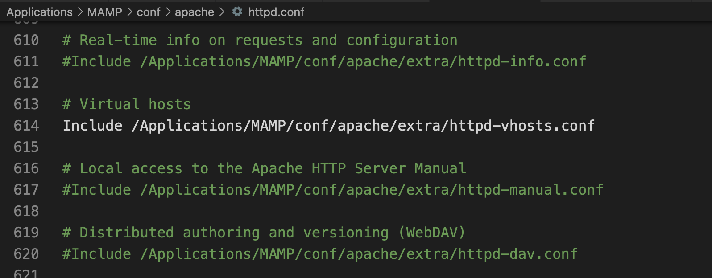
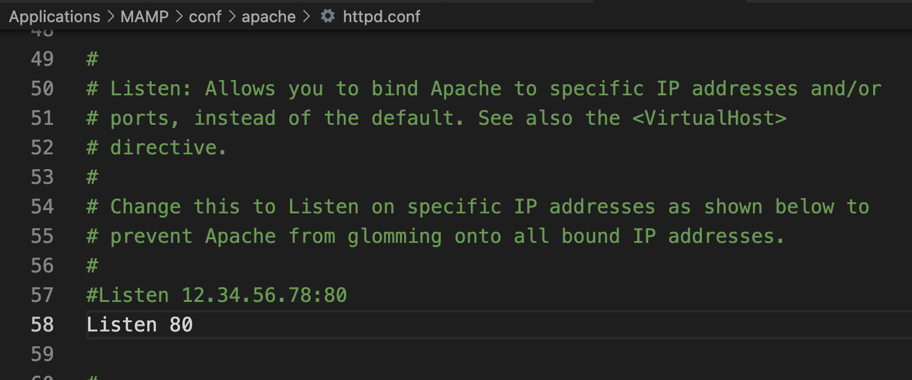
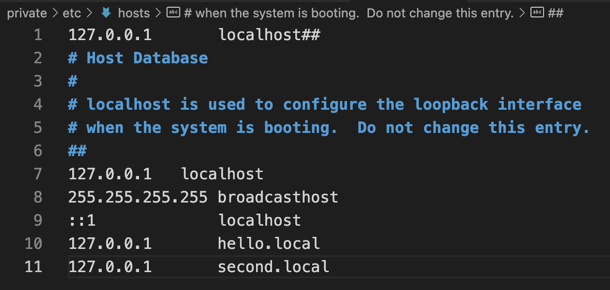
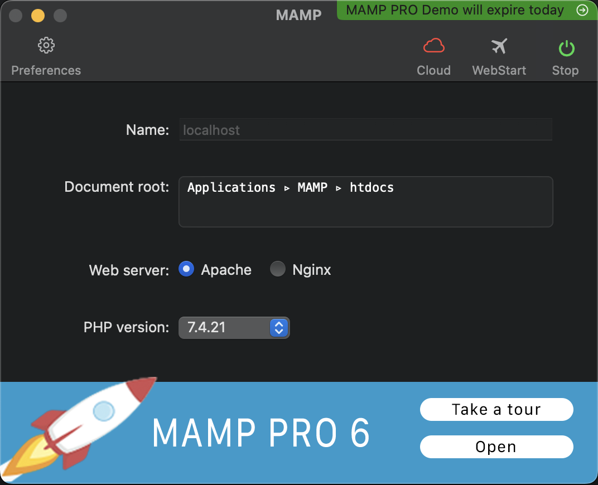
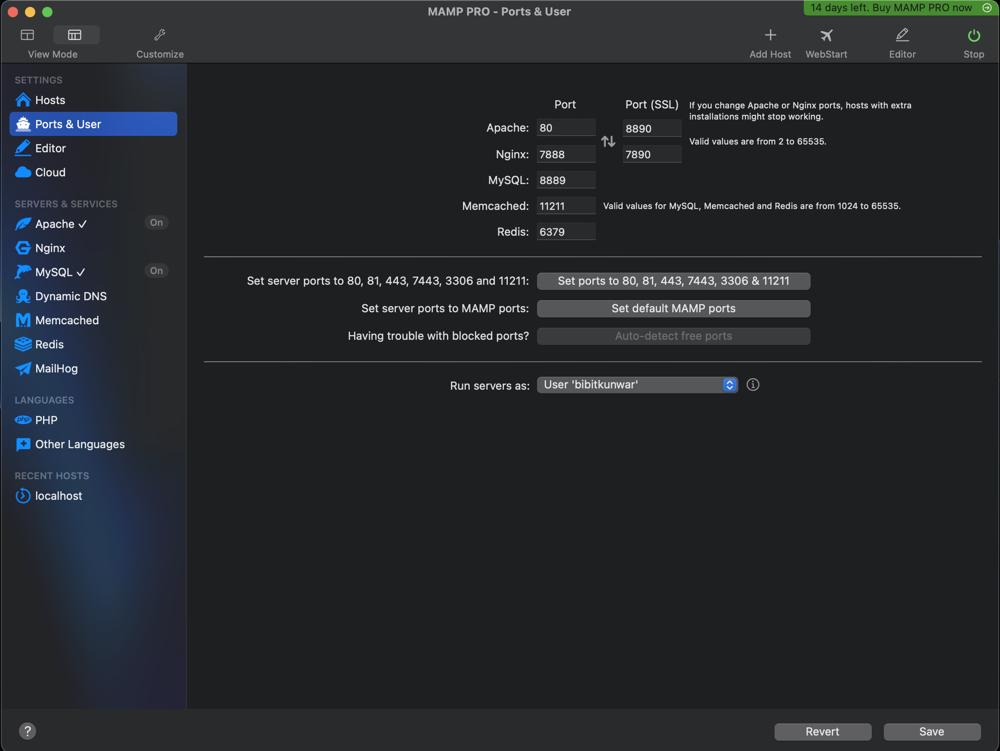
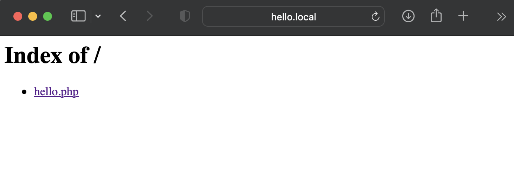
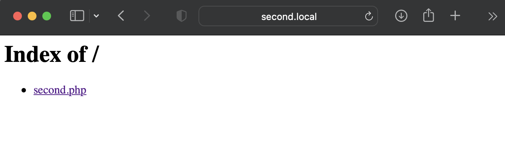

# Getting started with XAMP/MAMP(for macOS)

## What is MAMP?

Web development. PHP | Perl | Python. The name MAMP is an acronym that stems from the names of the components of the system: macOS (the operating system); Apache (the web server); MySQL or MariaDB (the database management system); and PHP, Perl, or Python (programming languages used for web development).

### Install  on macOS
`brew install MAMP`

### Creating Virtual Host
1. Include local host in httpd.conf


1. Listen port 80 in in httpd.conf


1. Add new local host( i.e hello.local & second.local ) on file system /etc/hosts


1. Launch MAMP and Start Local Server


1. Set port 80 for XAMP


1. Surfe for (https://local.host) and (https://second.local)



# php Overview 
``` 
<?php
    echo "Hello World!" 
?>
```
1. php code starts with <?pht and ends with ?>
1. echo helps to print in the browser screen