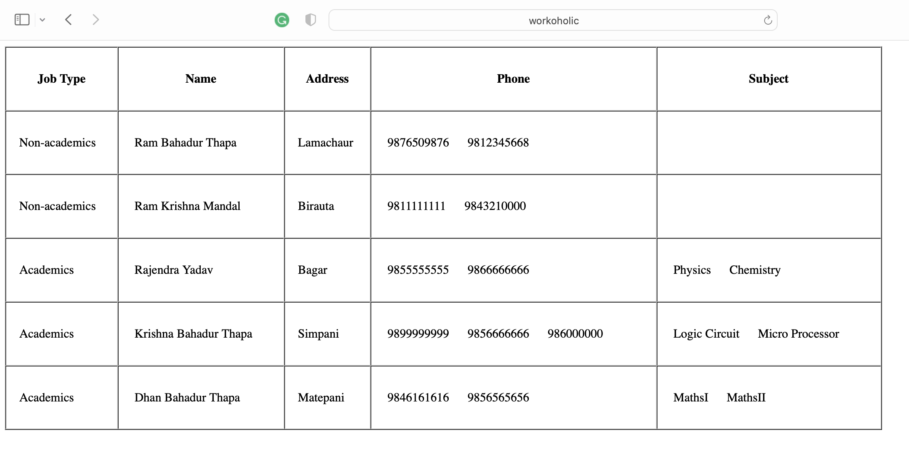
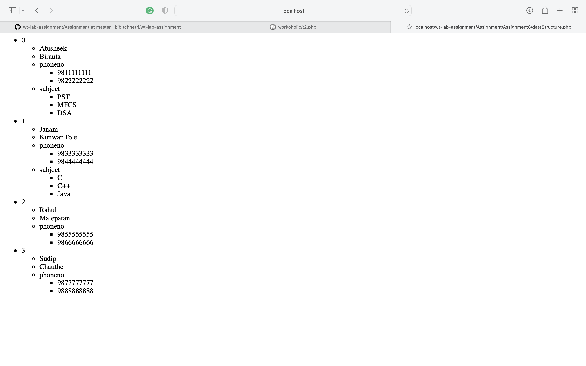

# Assignment 8:
#### Due : 2022/06/21 - 2022/06/22

### Screen Sorts :



## Sorting in PHP
* `PHP` has handful amount of sorting arrays which helps to sort the data in the document as per ones needs.
* Some of the major sorting arrays are given below:-
### sort():-
#### It is used to sort array in ascending order. It is sort by the value. <br> Syntax: <br> `sort($variable, sorttype)`<br> Example: 
``` 
 <?php
    $games = array("Ludo", "Carrom", "Chess");
    sort($games);
?>
```
### rsort():-
#### It is used to sort array in descending order. It is sort by the value. <br> Syntax: <br> `rsort($variable, sorttype)`<br> Example: 
``` 
 <?php
    $age = array(56,11,13,6);
    rsort($age);
?>
```
### asort():-
#### It is used to sort associative arrays in ascending order. It is sort by the value. <br> Syntax: <br> `asort(array, sorttype)`<br> Example: 
``` 
 <?php
$age=array("Alwyn"=>"35","Teddy"=>"37","Joe"=>"43");
asort($age);
?>
```
### ksort():-
#### It is used to sort associative arrays in ascending order. It is sort by the key. <br> Syntax: <br> `ksort(array, sorttype)`<br> Example: 
``` 
 <?php
$age=array("Alwyn"=>"35","Teddy"=>"37","Joe"=>"43");
ksort($age);
?>
```
### arsort():-
#### It is used to sort associative arrays in descending order. It is sort by the value. <br> Syntax: <br> `arsort(array, sorttype)`<br> Example: 
``` 
 <?php
$age=array("Alwyn"=>"35","Teddy"=>"37","Joe"=>"43");
arsort($age);
?>
```
### krsort():-
#### It is used to sort associative arrays in descending order. It is sort by the key. <br> Syntax: <br> `krsort(array, sorttype)`<br> Example: 
``` 
 <?php
$age=array("Alwyn"=>"35","Teddy"=>"37","Joe"=>"43");
krsort($age);
?>
```