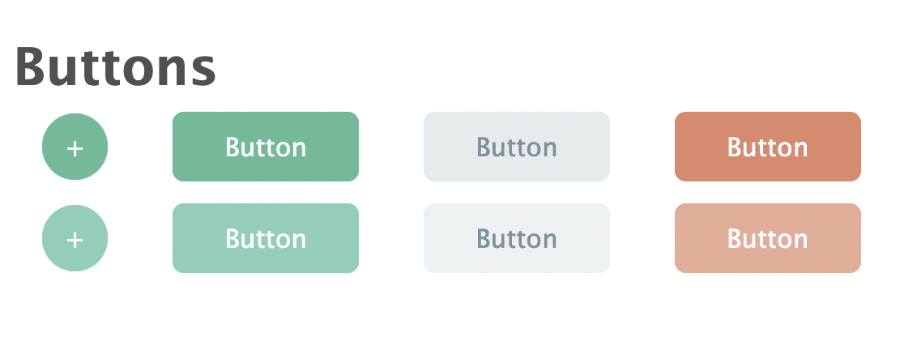
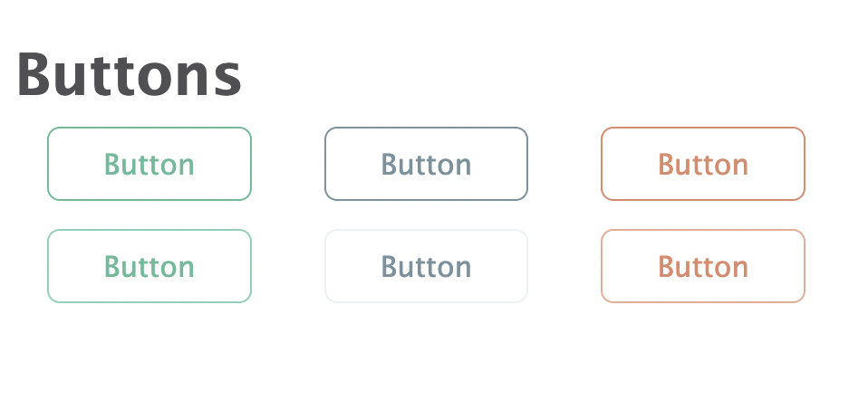
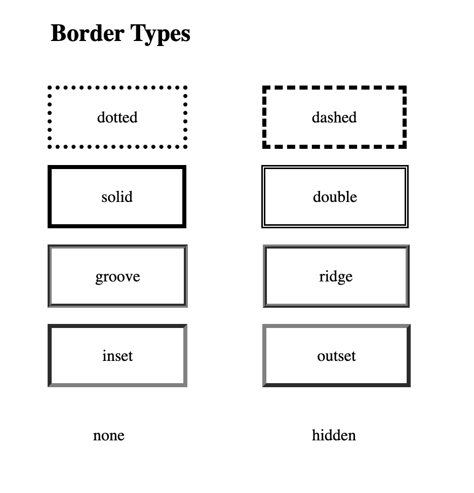

# LabWork 1
37th April-4th May

## Screenshots
### Task 1

### Task 2

### Task 3



# Theory

## CSS Selectors

CSS selectors are used to "find" (or select) the HTML elements you want to style.

We can divide CSS selectors into five categories:

- Simple selectors (select elements based on name, id, class)
- Combinator selectors (select elements based on a specific relationship between them)
- Pseudo-class selectors (select elements based on a certain state)
- Pseudo-elements selectors (select and style a part of an element)
- Attribute selectors (select elements based on an attribute or attribute value)

## Notes

#### Background
The CSS background properties are used to add background effects for elements.

#### Borders
The CSS border properties allow you to specify the style, width, and color of an element's border.

#### Margins
Margins are used to create space around elements, outside of any defined borders.

#### Padding
Padding is used to create space around an element's content, inside of any defined borders.

#### Height, Width and Max-width
The CSS height and width properties are used to set the height and width of an element.

The CSS max-width property is used to set the maximum width of an element.

#### Text color
The color property is used to set the color of the text. The color is specified by:
```bash
  a color name - like "red" 
  a HEX value - like "#ff0000"
  an RGB value - like "rgb(255,0,0)" 
```